<p align="center">
  
</p>

A complete, end‑to‑end pipeline for ingesting raw customer data, cleaning it, generating insightful visualizations, and producing an AI‑powered analysis report (Markdown → PDF). The workflow is modular, easy to extend, and designed for both quick exploratory analysis and production‑ready reporting.

<p align="center">
  
</p>


**Target Users**
----------------
### This is made for the retail sales,small shops,local shopkeepers,small vendors,malls who maintain records of their sales can analyse and understand their business churn percentage and do better to maintain their business and keep growing


---

## Project Structure

```
customer_churn_analysis/
│
├─ data/                           # Raw data sources (CSV, Excel, JSON)
│   ├─ c1.csv
│   └─ customer_churn.xlsx
│
├─ cleaned data/                   # Stores the cleaned CSV produced by pipeline.py
│   └─ cleaned.csv
│
├─ charts/                         # Auto‑generated charts (PNG) from visual.py
│   ├─ charts_YYYY-MM-DD_XX/
│   └─ ...
│
├─ scripts/                        # Core Python modules
│   ├─ pipeline.py                 # Data ingestion & cleaning
│   ├─ visual.py                   # Automated EDA chart generation
│   ├─ ai_model.py                 # Vision‑LLM chart analysis (Gemini)
│   ├─ create_pdf.py               # Convert Markdown report to PDF
│   └─ md files/                   # Markdown reports generated by ai_model.py
│
├─ final reports/                  # PDF reports generated by create_pdf.py
│   ├─ report_YYYY-MM-DD.pdf
│   └─ ...
|
├─ churn_report_heading.svg        # Real Time Heading Display Unit
├─ CLAUDE.md                       # Claude Code usage guidelines for this repo 
├─ data_pipeline_animation.svg     # Real Time Animation
├─ README.md                       # This file
├─ requirements.txt                # Python dependencies
```

---

## Setup

### Prerequisites
- Python 3.9+ (tested on 3.10–3.12)
- pip (or preferred package manager)
- A **Google Gemini API key** (free tier available at https://aistudio.google.com/app/apikey)

### Installation
```bash
# Clone the repository (if not already)
git clone <repo-url>
cd customer_churn_analysis

# Install dependencies
pip install -r requirements.txt
```

### Environment Variables
Create a `.env` file in the project root (or export the variable) :

```bash
export GEMINI_API_KEY="your_google_gemini_api_key_here"
```

The `ai_model.py` script reads this variable via `os.getenv("GEMINI_API_KEY")`.

---

```bash
# 1️⃣ Clean the data
python scripts/pipeline.py data/c1.csv data/customer_churn.xlsx -o cleaned.csv

# 2️⃣ Generate charts
python scripts/visual.py          # reads cleaned.csv by default

# 3️⃣ Analyze charts with AI
python scripts/ai_model.py charts/ -o md files/report.md

# 4️⃣ Convert to PDF
python scripts/create_pdf.py
```

All steps can be chained or run independently as needed.

---

## Example Usage (End‑to‑End)

```bash
# 1. Ingest and clean raw data
python scripts/pipeline.py data/c1.csv data/customer_churn.xlsx -o cleaned.csv

# 2. Generate visualizations (reads cleaned.csv from ../cleaned data/)
python scripts/visual.py
# → creates charts_2026-07-26_XX/

# 3. Get AI‑driven insights
python scripts/ai_model.py charts/ -o md files/report_2026-07-26.md

# 4. Produce a shareable PDF
python scripts/create_pdf.py
# → final reports/report_2026-07-26.pdf
```
---
## 📜 License
```
PERSONAL USE & LEARNING LICENSE
────────────────────────────────────────────────────────────────────────

Copyright (c) 2024 SoupFIX

Permission is hereby granted, free of charge, to any person obtaining
a copy of this software to:

  ✅  Run and experiment with it on their own local machine
  ✅  Read, study, and learn from the source code in depth
  ✅  Modify it privately for personal educational purposes
  ✅  Reference specific techniques or patterns with clear attribution

The following are explicitly NOT permitted:

  ❌  Copying this project in whole or in substantial part and
      publishing it as your own — on GitHub, npm, PyPI, or elsewhere
  ❌  Submitting this project or a close derivative as your own work
      for academic, professional, or commercial purposes
  ❌  Redistributing under a different name without prominent
      attribution linking back to the original author and repository

Attribution requirement:
  Any permitted derivative or reference must include a visible link
  to the original repository and credit to the original author.

The intent of this license is simple:
  → Learn from this freely. Build on the ideas. Do not plagiarize.

THE SOFTWARE IS PROVIDED "AS IS", WITHOUT WARRANTY OF ANY KIND.
THE AUTHOR IS NOT LIABLE FOR ANY CLAIM OR DAMAGES ARISING FROM USE.
```

---
**Happy analyzing!** 🚀
